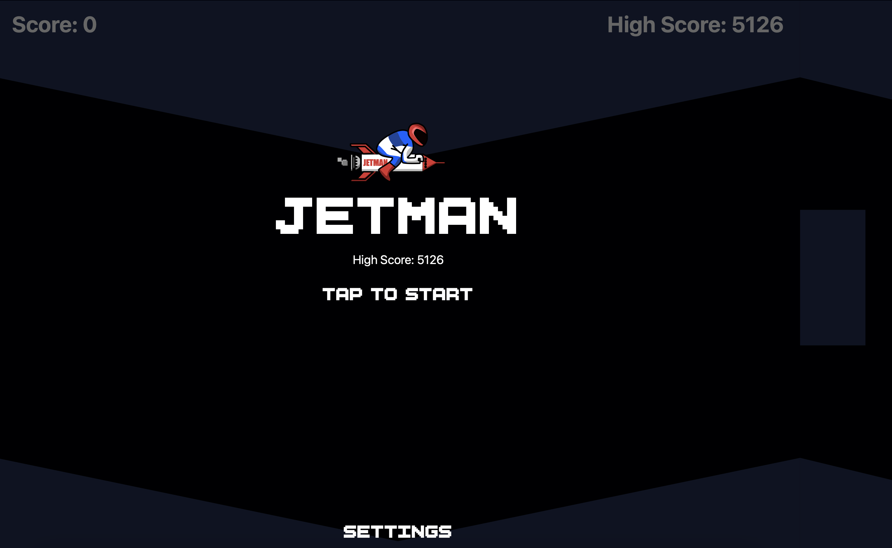

# Jetman

A fast, one‑thumb, portrait‑mode HTML5 arcade twist on the traditional helicopter game.
Navigate Jetman through the cave walls whilst dodging floating obstacles.
Touch the walls or a block and it’s **game over**.

## Objective
- **Survive** as long as possible by threading the tunnel and avoiding all obstacles.
- **Score** accumulates automatically over time (faster on higher difficulties).
- Beat your **High Score** (saved locally in your browser).

  

---

## Play Now

* **Live demo:** [*PLAY NOW*](https://htmlpreview.github.io/?https://github.com/ads1230/jetmanHTML5/blob/main/jetman.html)

## Controls
**Desktop**
- **Space** — thrust (also starts the game)
- **Mouse click** (on canvas) — thrust / tap UI buttons

**Mobile/Touch**
- **Tap & hold** — thrust
- **Tap** — start on the Start screen; press on‑screen text buttons (Settings, Retry, Home)
> Tip: releasing Space/touch immediately cuts thrust. Feather it to hover mid‑gap.

## Settings
### Difficulty
Choose **Beginner / Normal / Advanced**. Increases the speed of the game/

### Block Density
Choose **Normal (1×)**, **High (0.7×)**, or **Extreme (0.5×)**. Higher density means **tighter obstacle spacing** and more pressure.

### Wall Steepness
Flatten or increase the steepness of the cave walls.

## Roadmap

* [x] Centered passage (equal wall sizes)
* [x] Polygonal walls (non‑flat)
* [x] Obstacles avoid wall envelope
* [ ] Extra juice: camera shake & particles
* [ ] Power‑ups and difficulty ramp
* [ ] Touch UI polish & haptics
* [ ] Soundtrack + mute toggle
